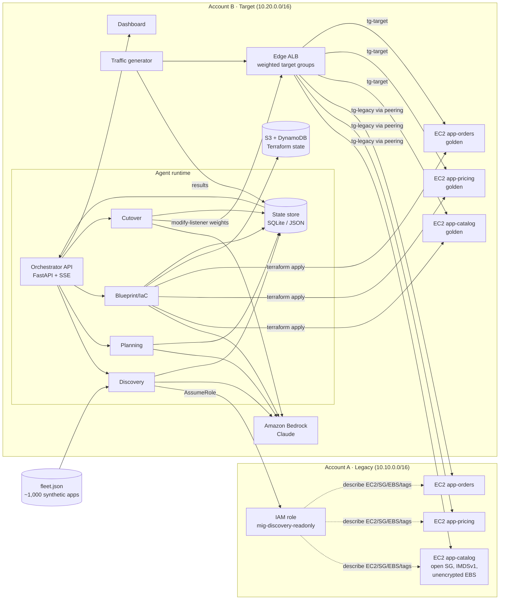

# Architecture

## Two-account design

| | **Account A — Legacy** | **Account B — Target (new landing zone)** |
|---|---|---|
| Represents | The old environment with thousands of apps and known issues | The new hardened environment, already live |
| VPC CIDR | `10.10.0.0/16` | `10.20.0.0/16` |
| Apps | 3 EC2 apps, deliberately insecure | Same 3 apps, rebuilt from the golden module |
| What also lives here | A read-only discovery role | Agent runtime, Bedrock, edge ALB, state store, dashboard |
| AWS CLI profile | `mig-legacy` | `mig-target` |

The two VPCs are connected by **VPC peering** in the same region. The edge ALB in Account B can reach legacy instances by private IP. This lets a single ALB front both old and new copies of each app, so a cutover is only a weight change.

## Components

### Legacy environment (Account A) — owned by C2

These 3 small stateless HTTP apps each return JSON that includes `served_by: "legacy"`, so a viewer can see which environment answered.

Each app is **deliberately misconfigured** so there is a visible story to tell. The headline finding is `NO_VPC_SEGMENTATION` (see [Cloud_ENVIRONMENTS.md](Cloud_ENVIRONMENTS.md) §5): Account A has one real VPC, but it was never given a private-subnet tier — every route table in it sends `0.0.0.0/0` to the IGW. `PUBLIC_IP` is the per-instance consequence of that, not a separate story about legacy AWS being unable to have private subnets.

| Finding code | Misconfiguration |
|---|---|
| `NO_VPC_SEGMENTATION` | The VPC has no private subnet — every route table routes `0.0.0.0/0` to the IGW |
| `SG_OPEN_SSH` | Port 22 open to `0.0.0.0/0` |
| `SG_OPEN_APP` | App port open to the world |
| `EBS_UNENCRYPTED` | Root volume not encrypted |
| `IMDSV1` | Instance metadata v1 still allowed |
| `OLD_AMI` | Amazon Linux 2 image from an older date |
| `PUBLIC_IP` | Instance sits in a public subnet with a public IP |
| `MISSING_TAGS` | No `owner`, `cost-center` or `data-class` tags |

Dependencies between the apps (`app-orders` → `app-pricing` → `app-catalog`) are expressed three ways, and Discovery must find them:

- tag `depends-on=app-pricing`
- SSM parameter `/legacy/app-orders/PRICING_URL`
- security-group rules that reference another app's security group

### Target environment (Account B) — owned by C1

- **Golden module** `modules/golden_app`. This is the one "proven" pattern: private subnet, encrypted EBS with KMS, IMDSv2 required, SSM access instead of SSH, current AMI, security group allowing ingress from the edge ALB only, and mandatory tags. This is the blueprint that Blueprint matches apps against.
- **Edge ALB**. One listener rule per app, based on host or path. Each rule forwards to two target groups: `tg-<app>-legacy`, which holds legacy instance IPs across the peering connection, and `tg-<app>-target`. Weights start at 100/0.
- **Terraform state** lives in S3 with DynamoDB locking, both in Account B.
- **Reference app** `app-hello`. It's already live on the golden module, which proves the blueprint works in production.

### Agent runtime (Account B) — owned by A1–A4

All agents run on one process host: a laptop or a single EC2 or Cloud9 box using the `mig-target` profile.

| Agent | Input | Output | AWS actions | Uses the LLM for |
|---|---|---|---|---|
| Discovery | Legacy account + `fleet.json` | `AppRecord[]`, `Tiering[]` | EC2, ELBv2 and SSM describe calls (read-only, via AssumeRole) | Classifying ambiguous configs; one-line risk summaries |
| Planning | `AppRecord[]`, `Tiering[]` | `WavePlan` | none | Wave rationale text (optional) |
| Blueprint/IaC | One `AppRecord` + the golden module schema | `BlueprintResult` + `generated/<app>/main.tf` | `terraform plan/apply` in B | Mapping legacy config to golden inputs; explaining the diff |
| Cutover | `BlueprintResult`, target group ARNs | `CutoverRun` | ELBv2 `modify-listener`/`modify-rule`, target health | Summarizing the go/no-go decision |

**Rule: the LLM decides, and code acts.** Every AWS call is a typed Python tool function. The LLM chooses which tool to call and with what arguments. Every argument is validated before execution, and all destructive tools are allowlisted to Account B resources that carry the tag `managed-by=migration-accelerator`.

### Orchestrator and dashboard — owned by A2 and C2

- **FastAPI orchestrator.** Starts and stops agent runs and exposes REST endpoints for the current state.
- **Event stream.** Every agent writes events (`agent`, `app_id`, `type`, `payload`, `ts`) to the store, and they are pushed to the UI over **Server-Sent Events**.
- **Dashboard.** React with React Flow for the dependency graph and Recharts for charts. It reads only from the orchestrator.

## Tech stack

| Layer | Choice | Why |
|---|---|---|
| IaC | Terraform ≥ 1.6, AWS provider v5 | One language for both accounts; parameterized modules |
| Compute | EC2 t3.micro | Cheap. Rehost matches the real engagement (EC2 to EC2) |
| Traffic switch | ALB weighted target groups | Switches instantly, with health checks built in and no DNS caching |
| LLM | Claude on Amazon Bedrock, through `anthropic[bedrock]` (`AnthropicBedrock`) | Stays inside AWS, and matches the Anthropic-on-Bedrock story |
| Agent pattern | Direct tool-calling loop, no framework | Fastest to build and debug in 48 h |
| Language | Python 3.11 | boto3, FastAPI, networkx, Faker |
| State | SQLite (a single file) | No infrastructure; easy to reset |
| UI | React + Vite, React Flow, Recharts | Fast to build and handles large graphs |
| Synthetic data | Faker + networkx | Realistic dependency graphs |

## Security guardrails (worth saying to judges)

- Discovery is **read-only** and is scoped by a trust policy to one role in Account B.
- Mutating tools only touch resources tagged `managed-by=migration-accelerator`.
- The LLM never writes raw HCL. It fills golden-module variables, which are schema-validated, and every plan passes `terraform validate` before apply.
- Every agent action is logged as an event with the prompt, the tool call and the result. That log is the audit trail.
- No secrets go in prompts. Only config metadata is sent to the model.

## What's real vs. simulated

| Real | Simulated |
|---|---|
| Both AWS accounts, VPCs, peering, ALB, EC2 | ~1,000 synthetic apps (records only, no infrastructure) |
| Discovery scanning of the 3 real apps | Data migration (progress bar + log lines) |
| Terraform generation and apply for the 3 apps | Decommissioning (a "teardown scheduled" event) |
| Live traffic shift and health gates | Licensing checks (a flag on Red-tier records) |
| Auto-rollback | Notifications (toast messages in the UI) |

## Scaling narrative (for Q&A)

- **Traffic shifting.** Route 53 weighted records or the client's ingress layer replace the single edge ALB.
- **Stateful apps.** These hook into native replication tools (DMS, database replicas, EBS snapshot copy) rather than a custom mover.
- **Scale-out.** Each agent becomes a Step Functions task and waves run in parallel. Discovery reads from AWS Config or Resource Explorer aggregators instead of describe calls.
- **Throughput.** Golden-tier apps flow with no human touch. Gray apps get a human approval gate on the diff. Red apps are routed to an engineering queue.
