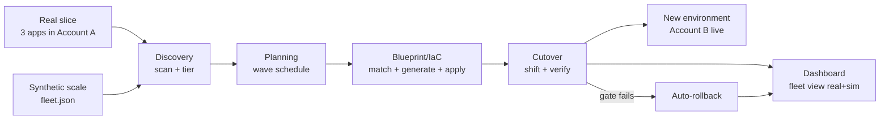
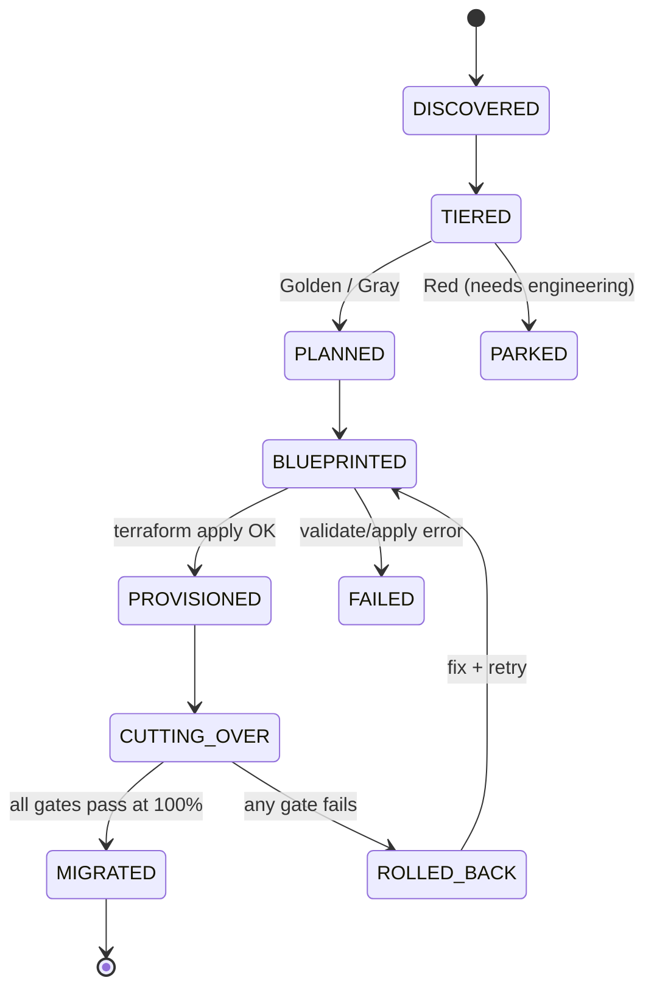
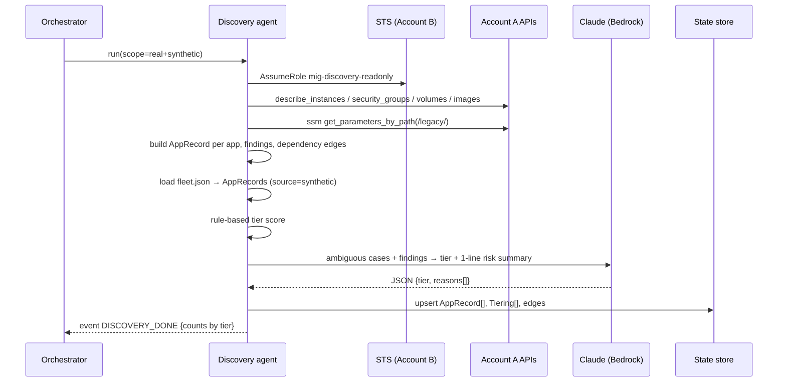
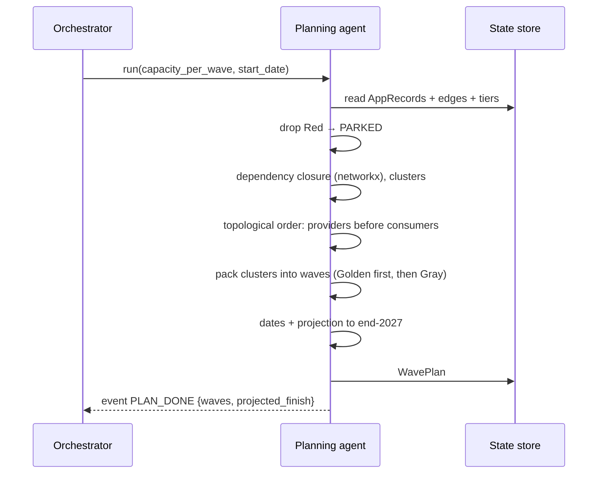
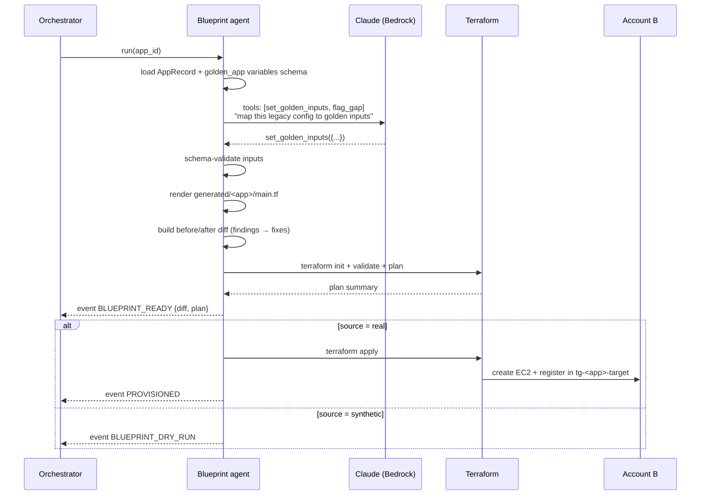
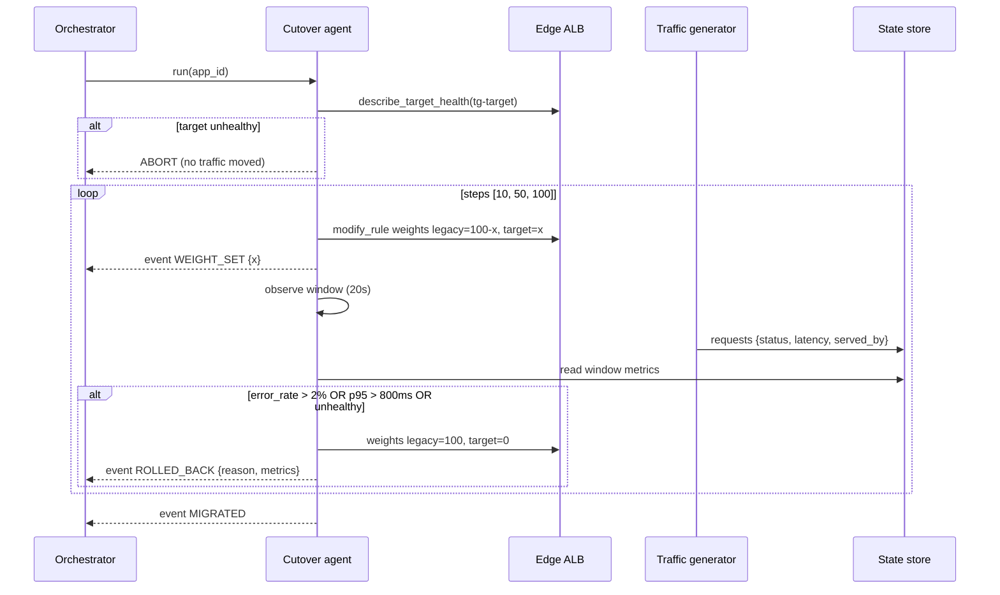

# End-to-End Flow

## 1. Pipeline at a glance

**Real apps** go through all four stages. **Synthetic apps** go through Discovery and Planning, then Blueprint runs in *dry-run* mode (diff only, no apply) and Cutover is simulated.

Every record carries `source: "real" | "synthetic"`, and each agent branches on that field.

## 2. App lifecycle (state machine)

The orchestrator owns these transitions. An agent may only move an app forward from the state it was handed.

## 3. Discovery

## 4. Planning

The 3 real apps are always placed in **Wave 0 (pilot)**, so they can be demoed immediately.

## 5. Blueprint / IaC

## 6. Cutover and auto-rollback

**Gates** (configurable in `agents/cutover/config.yaml`):

| Gate | Threshold |
|---|---|
| Target health | All targets `healthy` before each step |
| Error rate | ≤ 2% of requests in the window |
| Latency | p95 ≤ 800 ms |
| Served-by check | At least 80% of the expected share is served by the target (proves traffic really moved) |

The **LLM does not trigger rollback**. Rollback is pure code, so it is deterministic and fast. Claude only writes the human-readable explanation afterwards: "Rolled back at 10%: 38% 5xx from target, likely a missing `PRICING_URL`."

## 7. The bad wave (scripted moment)

1. C2 prepares `app-orders` with a blueprint variant that **omits the `PRICING_URL` input**. The golden module still applies, but the app returns 500s.
2. Presenter clicks **Run wave 1** on the dashboard.
3. Cutover sets weights to 10%, and the traffic generator sees a spike in 5xx responses.
4. The gate fails, weights snap back to 100/0 in about 1 s, and the dashboard flashes red and then shows *Rolled back*.
5. Claude's explanation appears alongside the event.
6. Optionally, click **Fix & retry**. Blueprint re-runs with the input restored, and the cutover goes green.

Controlled by: `POST /demo/bad-wave {app_id, enabled}` (orchestrator).

## 8. Data flow between agents

| From → To | Object | Stored as |
|---|---|---|
| Discovery → Planning | `AppRecord[]`, `Tiering[]`, edges | `apps`, `tiers`, `edges` tables |
| Planning → Blueprint | `WavePlan` (ordered app_ids) | `waves` table |
| Blueprint → Cutover | `BlueprintResult` (tg ARNs, instance IDs) | `blueprints` table |
| Cutover → Dashboard | `CutoverRun` + events | `cutovers`, `events` tables |
| Everyone → Dashboard | `Event` stream | `events` table → SSE `/events` |

Schemas: [CONTRACTS.md](CONTRACTS.md).
